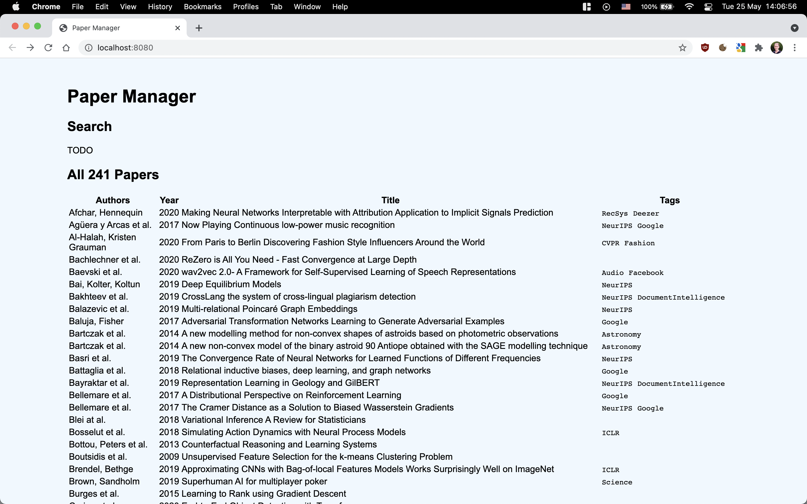

# PDF Paper Manager

This PDF Paper Manager is a tiny side project which I use to get a better overview of papers I have stored on my machine / Google Drive.
I keep all papers relevant to my research in a single folder.
The individual PDF files are following a certain naming convention which is specified below.

This project just reads all the file names from the paper folder and lists them on a web page.
The screenshot below shows that (at the state of commit [9622d4d](https://github.com/Simsso/PDF-Paper-Manager/commit/9622d4da585e50322b2a343556e962223192a4af)).



Valid names for papers are for example:

```
Devlin et al. (2018) BERT [Google].pdf
Author1 and Author2 and Author3 (2020) Paper Title.pdf
Single Author (2030) Title [Tag1,Tag2].pdf
```

The general idea for **paper names** is that an 

1. `and`-concatenated author list (potentially abbreviated with `et al.`) is followed by the 
2. paper publication year. That in turn is followed by the 
3. paper title. Last is a 
4. list of tags in square brackets.

For **tags** I typically use

* conference names (e.g., `NeurIPS`, `ICML`),
* institutions (e.g., `FB`, `Google`), and 
* research domains (e.g., `Climate`, `Audio`, `NLP`).


## Run Locally

This is a Node.js application which you can run locally on your machine.
I use Node 16.1 for development, but other versions are likely to work as well.

Copy the configuration file.

```bash
cp .env.sample .env
```

Edit the configuration file `.env` and adjust it to your needs.

Install all dependencies, run tests, and start the application.

```bash
npm install
npm test
npm start
```
